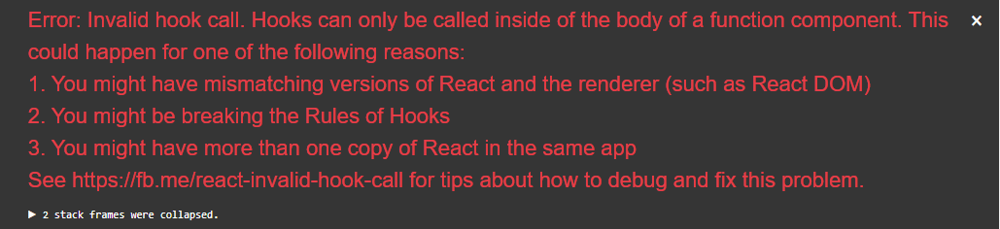

# React UI Library

This is template for creating React JS library. The library can be all TypeScript, all JavaScript, 
or a mix of both. It also shows how you can manage a SCSS theme in your library for consumption across
applications. You can remove this if you don't have a need for this.

It demonstrates the following:

1. Using [Rollup.js](https://rollupjs.org/guide/en) to build ES and Common JS modules.
1. Bundling images in a library.
1. Demonstrates one approach for managing a CSS theme across consumers of this library. 
1. A demo application that uses the library.
1. NPM scripts for live reload of the library during development.

## How to use.

This library isn't published publicly, but can be experimented with locally. Here are the steps:

1. Run `npm i` in the root folder.
1. Run `npm link` to add the library to your local npm modules.
1. Run `npm run build:watch` to build the library and watch for changes.
1. Run `npm i` in the demo folder.
1. Run `npm link @pcalouche/react-ui-lib` in the demo folder to link the library to your local npm modules.
1. Run `npm run start` in the demo folder to load the demo.

Run `npm run build` from the root folder to build the library. This creates `dist` folder which contains
everything that would be published to npm.

**Note:** If this library was available in a repository, demo's package.json would include 
`"@pcalouche/react-ui-lib": "1.0.0"` as a dependency.

## Avoiding Multiple Instances Warning With React Hooks

When using `npm link @pcalouche/react-ui-lib` to develop your library with the demo or another 
consuming application you may run across React invalid hook call errors. 

This happens when you're using React hooks in your consuming application. The application becomes confused between 
the React installed under `node_modules` folder and React under the `node_modules/@pcalouche-react-ui-lib/node_modules` 
folder. The latter is created by the `npm link @pcalouche/react-ui-lib` command. The solution is to give 
your consuming application a hint on which instance of React to use when you have are using `npm link`. This 
is not an issue when you install the library from a npm repository. Only when using `npm link`. The demo uses 
Create React App. I don't want to eject the config because I like the default setup it provides for me. 
Thankfully [Craco - Create React App Configuration Override](https://github.com/gsoft-inc/craco) 
exists. See the script configuration in `package.json` and the `craco.config.js` on how it's configured. 
If you're using your own webpack configuration and not Create React App, that's ok too. You'll just need 
to add an `alias` references to your webpack config.  You'll need to do this for any other library that you 
bring that has React hooks if your application accesses those hooks. Some common ones are `react-router-dom`
and `formik`.

## TypeScript Only Library Steps

1. Remove the following dev dependencies from `package.json`
   - @babel/core
   - @babel/plugin-transform-runtime
   - @babel/preset-env
   - @babel/preset-react
   - @rollup/plugin-babel
1. Remove the babel plugin configuration in `rollup.js`
1. Set `allowJs` to false in `tsconfig.json`.
1. Name the library how you want to in `package.json`

## JavaScript Only Library Steps

1. Remove the following dev dependencies from `package.json`:
    - rollup-plugin-typescript2
    - typescript
1. Remove the `types` key in package.json
1. Delete `tsconfig.json`.
1. Delete `custom.d.ts`
1. Convert ts and tsx files to js.
1. Name the library how you want to in `package.json`

## Mix of TypeScript and JavaScript Library Steps

Useful if you currently have a JavaScript library and want to gradually migrate it to TypeScript.

1. Name the library how you want to in `package.json`. No other changes required!

